## Time Series, Regression & Predictive Modeling

## Time Series Basics
Time series is a core concept in data science and analytics, particularly when data is collected over time intervals.
Let me break down the key aspects of time series, especially relevant if you're doing forecasting, anomaly detection, or trend analysis:

## Temporal Order

**Definition:**
Observations are collected at specific time intervals (daily, monthly, yearly, etc.).

**Importance:**
Order matters; past values influence future ones.

## Components of Time Series

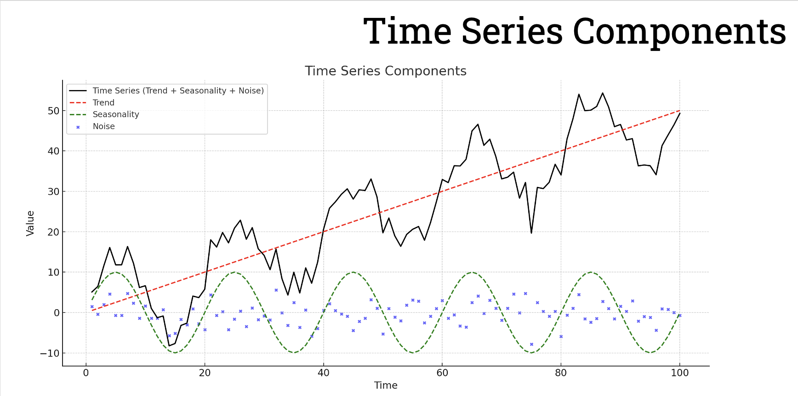

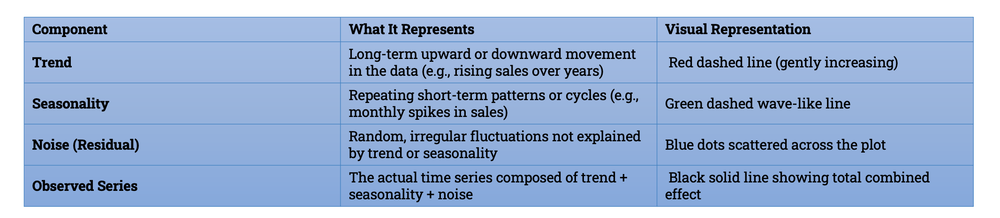

1. **Trend:** Long-term increase or decrease in the data.(E.g., sales increasing over years due to company growth.)
2. **Seasonality:** Repeating short-term cycles (e.g., sales spike every December).(Can be daily, weekly, monthly, quarterly, etc.)
3. **Cyclic Patterns:** Fluctuations over long, non-fixed periods.(Usually driven by economic conditions or business cycles.)
4. **Irregular (Noise):** Random variation; not explained by trend/seasonality.(Often treated as residuals in models.)
5. **Goal:** Use past data to forecast future values


**Time Series** is data collected at regular time intervals.
**Examples:**
- Daily stock prices
- Monthly rainfall
- Hourly website traffic


## Stationarity & Non-stationary in Time Series
1. **Stationary series:** Mean, variance, autocorrelation are constant over time. 


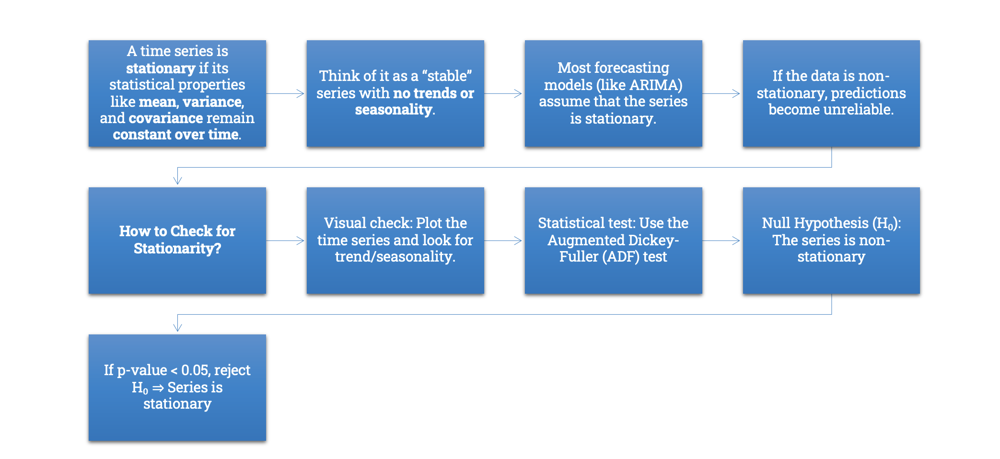

## Stationary Series Example
✅ Stationary Series Example — White Noise
A stationary time series has: 
- White noise is a random sequence of values with:
    - Constant mean (usually 0)
    - Constant variance
    - No trend or seasonality

📊 Python Code to Plot White Noise
```
import numpy as np
import matplotlib.pyplot as plt
import seaborn as sns

# Generate white noise
np.random.seed(42)
white_noise = np.random.normal(loc=0, scale=1, size=100)

# Plot time series
plt.figure(figsize=(12, 4))
plt.plot(white_noise, color='blue', label='White Noise')
plt.axhline(y=0, color='red', linestyle='--', label='Mean = 0')
plt.title("White Noise - Stationary Series")
plt.xlabel("Time")
plt.ylabel("Value")
plt.legend()
plt.grid(True)
plt.tight_layout()
plt.show()
```

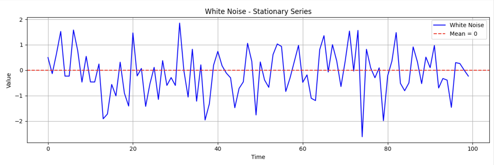

🧠 Explanation of the Plot
- 📉 The values fluctuate randomly around the horizontal red dashed line (mean = 0).
- 🟦 There’s no visible upward or downward trend.
- 🎯 The variance stays consistent (spread of data remains the same).
- ✅ This makes it a stationary time series.

📌 Bonus: ADF Test to Confirm Stationarity
```
from statsmodels.tsa.stattools import adfuller
import numpy as np

# Generate white noise
np.random.seed(42)
white_noise = np.random.normal(loc=0, scale=1, size=100)

result = adfuller(white_noise)
print("ADF Test Statistic:", result[0])
print("p-value:", result[1])
print("=> Stationary ✅" if result[1] < 0.05 else "=> Not Stationary ❌")
```

```
ADF Test Statistic: -10.084425913669714
p-value: 1.1655044784188669e-17
=> Stationary ✅
```

📊 Visual Comparison: Stationary vs Non-Stationary Series
```
import numpy as np
import matplotlib.pyplot as plt
import pandas as pd
from statsmodels.tsa.stattools import adfuller

np.random.seed(42)

# --- White Noise (Stationary) ---
white_noise = np.random.normal(loc=0, scale=1, size=100)

# --- Trending Series (Non-Stationary) ---
trend = np.linspace(0, 10, 100) + np.random.normal(0, 1, 100)

# --- Seasonal Series (Non-Stationary) ---
seasonal = 5 * np.sin(np.linspace(0, 20, 100)) + np.random.normal(0, 0.5, 100)

# ==== Plot All ====
plt.figure(figsize=(15, 8))

# White Noise
plt.subplot(3, 1, 1)
plt.plot(white_noise, label='White Noise', color='blue')
plt.axhline(y=np.mean(white_noise), color='red', linestyle='--', label='Mean')
plt.title("✅ Stationary Series: White Noise")
plt.legend()
plt.grid()

# Trending Series
plt.subplot(3, 1, 2)
plt.plot(trend, label='Trending Series', color='green')
plt.title("❌ Non-Stationary Series: Trend")
plt.legend()
plt.grid()

# Seasonal Series
plt.subplot(3, 1, 3)
plt.plot(seasonal, label='Seasonal Series', color='orange')
plt.title("❌ Non-Stationary Series: Seasonality")
plt.legend()
plt.grid()

plt.tight_layout()
plt.show()
```

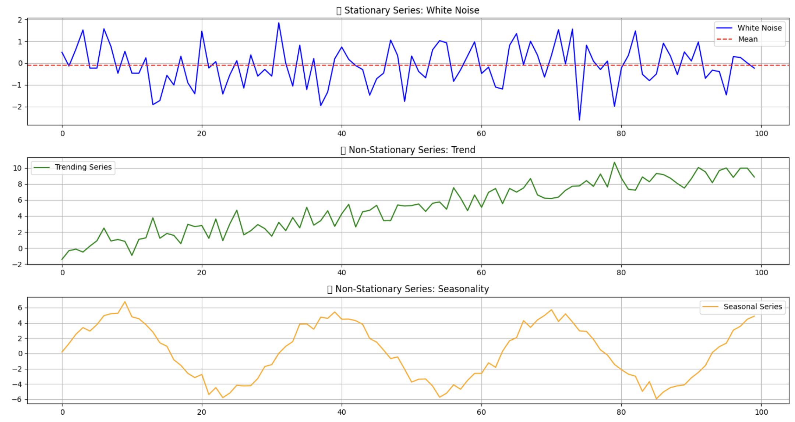

📌 Visual Summary
| Series Type     | Description                                 | Stationary? |
| --------------- | ------------------------------------------- | ----------- |
| **White Noise** | Random around mean 0, constant variance     | ✅ Yes       |
| **Trend**       | Values increase steadily over time          | ❌ No        |
| **Seasonality** | Regular up/down pattern over fixed interval | ❌ No        |


🧪 ADF Test on Each
```
def adf_test(series, name):
    result = adfuller(series)
    print(f"{name} - ADF p-value: {result[1]:.4f} => {'Stationary ✅' if result[1] < 0.05 else 'Not Stationary ❌'}")

adf_test(white_noise, "White Noise")
adf_test(trend, "Trending Series")
adf_test(seasonal, "Seasonal Series")
```

```
White Noise - ADF p-value: 0.0000 => Stationary ✅
Trending Series - ADF p-value: 0.8826 => Not Stationary ❌
Seasonal Series - ADF p-value: 0.0000 => Stationary ✅
```

🔹 Differenced Stock Returns
While stock prices are non-stationary, daily returns are often stationary.
✅ Mean and variance stable over time, no strong trend.

🔹 Temperature Anomalies (after de-trending)
Global temperature anomalies after removing long-term climate trend.
✅ Can be stationary if trend/seasonality removed.

🔹 Heart Rate Variability (in controlled settings)
- Measured over short intervals in healthy individuals.
- Can be stable around a mean with limited variance.
✅ Stationary under resting conditions.


🔹 What is Differencing?
Differencing removes trend (and sometimes seasonality) by subtracting the previous value from the current one.

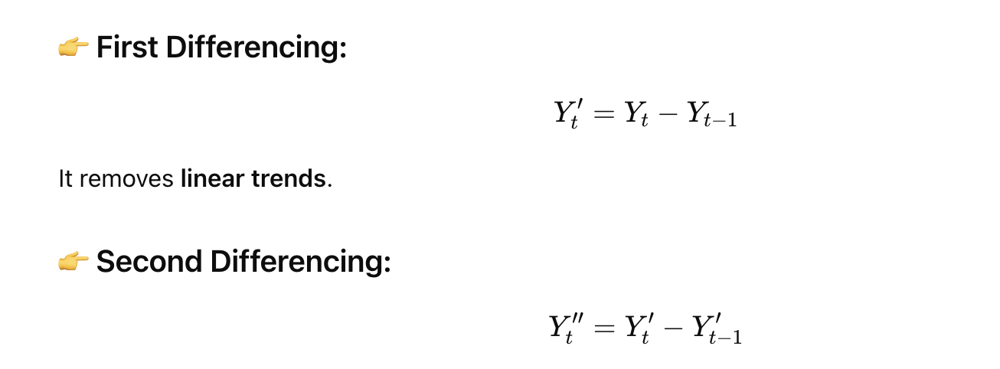

Used when there's still a trend after first differencing (e.g., quadratic or accelerating trends).


**Step 1:** Create a Trending (Non-Stationary) Series
```
import numpy as np
import matplotlib.pyplot as plt
import pandas as pd

np.random.seed(42)

# Original series with upward trend
time = np.arange(100)
trend_series = time + np.random.normal(0, 1, size=100)

# First difference
first_diff = np.diff(trend_series, n=1)

# Second difference
second_diff = np.diff(trend_series, n=2)
```

📊 Step 2: Plot All Three Series
```
plt.figure(figsize=(14, 8))

# Original
plt.subplot(3, 1, 1)
plt.plot(trend_series, label='Original Series (Non-Stationary)', color='orange')
plt.title("❌ Original Series with Trend")
plt.grid()
plt.legend()

# First difference
plt.subplot(3, 1, 2)
plt.plot(first_diff, label='1st Difference', color='green')
plt.axhline(np.mean(first_diff), color='red', linestyle='--', label='Mean')
plt.title("➡️ First Differenced Series (Removes Linear Trend)")
plt.grid()
plt.legend()

# Second difference
plt.subplot(3, 1, 3)
plt.plot(second_diff, label='2nd Difference', color='blue')
plt.axhline(np.mean(second_diff), color='red', linestyle='--')
plt.title("➡️ Second Differenced Series (Removes Quadratic Trend)")
plt.grid()
plt.legend()

plt.tight_layout()
plt.show()
```

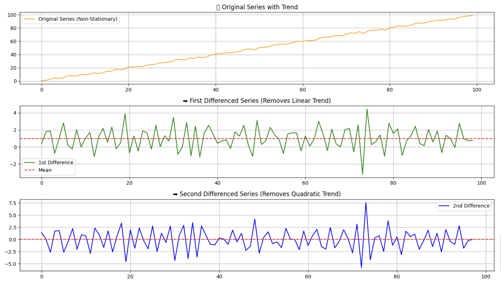

🧠 Explanation
| Step     | What Happens                              | Trend Removed? | Stationary? |
| -------- | ----------------------------------------- | -------------- | ----------- |
| Original | Steadily increasing → upward trend        | ❌ No           | ❌ No        |
| 1st Diff | Δ between each value → trend removed      | ✅ Linear       | ✅ Usually   |
| 2nd Diff | Δ between changes → only use if 1st fails | ✅ Quadratic    | ✅ Yes       |

🧪 ADF Stationarity Check
```
from statsmodels.tsa.stattools import adfuller

def adf_check(series, name):
    result = adfuller(series)
    print(f"{name} | ADF p-value: {result[1]:.4f} => {'Stationary ✅' if result[1] < 0.05 else 'Not Stationary ❌'}")

adf_check(trend_series, "Original")
adf_check(first_diff, "1st Difference")
adf_check(second_diff, "2nd Difference")
```

```
Original | ADF p-value: 0.9773 => Not Stationary ❌
1st Difference | ADF p-value: 0.0000 => Stationary ✅
2nd Difference | ADF p-value: 0.0000 => Stationary ✅
```


✅ When to Stop Differencing?
- Stop as soon as you get stationarity (ADF p-value < 0.05).
- Don't over-difference, or you'll remove useful signal.

## Example:

Differencing to a real-world non-stationary dataset — for example, stock prices — to show how it makes the series stationary and ready for modeling.

📊 Real Dataset: Stock Prices Example (Apple Inc.)

1. Load stock price data (e.g., AAPL)
2. Plot original series (non-stationary)
3. Apply first and second differencing
4. Plot and run ADF test

✅ Step 1: Install & Import Required Libraries
```
pip install yfinance pandas matplotlib statsmodels
```
```
import yfinance as yf
import pandas as pd
import matplotlib.pyplot as plt
from statsmodels.tsa.stattools import adfuller
```

✅ Step 2: Load Apple Stock Data
```
# Load 2 years of daily Apple stock prices
df = yf.download("AAPL", start="2022-01-01", end="2024-12-31")
prices = df['Close']
prices = prices.dropna()
```

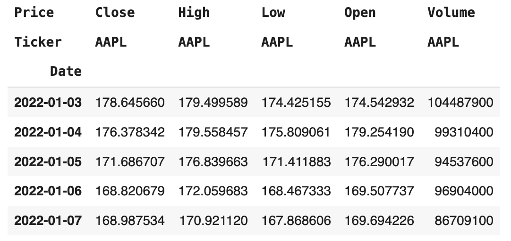

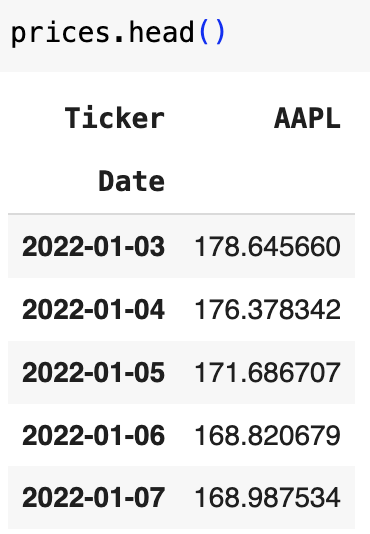


✅ Step 3: Plot Original Series
```
plt.figure(figsize=(12, 4))
plt.plot(prices, label='Original AAPL Close Prices', color='orange')
plt.title("❌ Original Stock Prices (Likely Non-Stationary)")
plt.xlabel("Date")
plt.ylabel("Price")
plt.legend()
plt.grid()
plt.show()
```

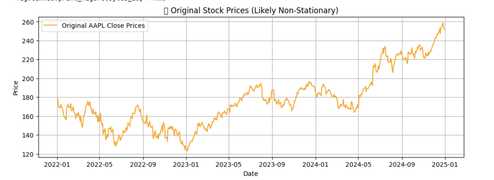

✅ Step 4: Apply First Differencing
```
first_diff = prices.diff().dropna()

plt.figure(figsize=(12, 4))
plt.plot(first_diff, label='1st Difference of AAPL Prices', color='green')
plt.title("✅ First Differenced Series (Log Returns Approx.)")
plt.xlabel("Date")
plt.ylabel("Price Change")
plt.axhline(y=0, color='red', linestyle='--')
plt.legend()
plt.grid()
plt.show()
```

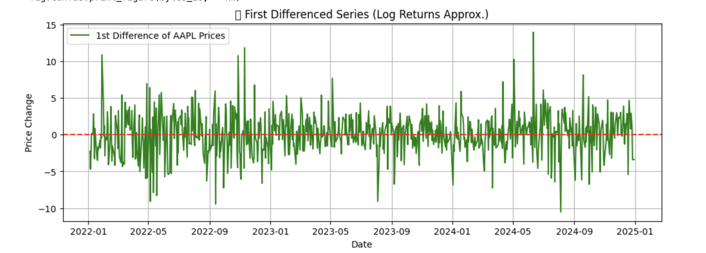

✅ Step 5: ADF Test on Each Series
```
def adf_check(series, name):
    result = adfuller(series)
    print(f"{name} | ADF p-value: {result[1]:.4f} => {'Stationary ✅' if result[1] < 0.05 else 'Not Stationary ❌'}")

adf_check(prices, "Original Series")
adf_check(first_diff, "1st Difference")
```

```
Original Series | ADF p-value: 0.9504 => Not Stationary ❌
1st Difference | ADF p-value: 0.0000 => Stationary ✅
```

🧠 What You Should Observe:
- **Original Series:**
    - Has an upward/downward trend.
    - ADF p-value > 0.05 → ❌ Not Stationary

- **First Differenced Series:**
    - Looks more like a noisy signal.
    - ADF p-value < 0.05 → ✅ Stationary


📌 Optional: Second Differencing (only if needed)
**Note:** But in most financial data, 1st differencing is enough.

✅ Summary
| Series                 | Looks Like        | ADF Test (p-value) | Stationary? |
| ---------------------- | ----------------- | ------------------ | ----------- |
| `prices`               | Trending          | > 0.05             | ❌ No        |
| `prices.diff()`        | No trend (flat)   | < 0.05             | ✅ Yes       |
| `prices.diff().diff()` | Over-differenced? | usually < 0.05     | ✅ Maybe     |


📊 Comparison: prices vs prices.diff()
| Feature           | `prices`                       | `prices.diff()`                     |
| ----------------- | ------------------------------ | ----------------------------------- |
| Meaning           | Actual stock prices            | Daily change in stock price         |
| Stationary?       | ❌ Typically **non-stationary** | ✅ Often **stationary**              |
| Trend/Seasonality | Contains trends                | Removes trend                       |
| Use in ARIMA      | Raw data → not usable directly | Used as input for ARIMA (`d=1`)     |
| First Value       | Actual closing price           | `NaN` (no previous day to subtract) |


🧠 Conceptual Example
Let’s say we have these 5 days of Apple stock prices:
Date       Price (prices)
--------------------------
Day 1      150
Day 2      152
Day 3      149
Day 4      151
Day 5      154


➡️ prices.diff() = Daily change:
Date       Change (prices.diff())
-------------------------------
Day 1      NaN        ← No previous day
Day 2      2    (152 - 150)
Day 3     -3    (149 - 152)
Day 4      2    (151 - 149)
Day 5      3    (154 - 151)

📈 Visual Comparison
```
import yfinance as yf
import matplotlib.pyplot as plt

# Download AAPL price data
df = yf.download("AAPL", start="2023-01-01", end="2023-12-31")
prices = df['Close']
daily_diff = prices.diff()

plt.figure(figsize=(14, 5))

# Original prices
plt.subplot(1, 2, 1)
plt.plot(prices, label="AAPL Prices", color='orange')
plt.title("📈 AAPL Stock Prices (Non-Stationary)")
plt.xlabel("Date"); plt.ylabel("Price")
plt.grid(); plt.legend()

# Differenced prices
plt.subplot(1, 2, 2)
plt.plot(daily_diff, label="Daily Price Change", color='green')
plt.axhline(y=0, color='red', linestyle='--')
plt.title("📉 AAPL Daily Price Change (Stationary)")
plt.xlabel("Date"); plt.ylabel("Δ Price")
plt.grid(); plt.legend()

plt.tight_layout()
plt.show()
```

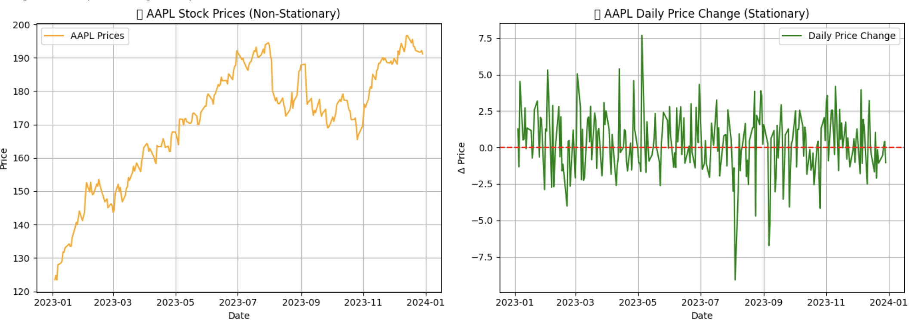

✅ When to Use prices.diff()
You should use prices.diff() when:
- You want to remove trend for modeling.
- You're building ARIMA, LSTM, or other time series models.
- You need a stationary signal.

🧠 Summary
| Task                              | Use                                  |
| --------------------------------- | ------------------------------------ |
| Plot/visualize trends             | `prices`                             |
| Train ARIMA, forecast next values | `prices.diff()`                      |
| Calculate daily returns           | `prices.pct_change()` (for % change) |


## A real-world forecasting example using prices.diff() with ARIMA, based on stock price data (Apple Inc.). This will help you understand:

1. Why we use prices.diff()
2. How to fit an ARIMA model
3. How to forecast future stock price changes
4. How to reconstruct actual prices from the forecasted diffs

## 📦 Tools You Need

```
pip install yfinance pandas matplotlib statsmodels pmdarima
```

✅ **Step-by-Step Forecasting Using** prices.diff() **+ ARIMA**

📌 **Step 1: Import and Load Apple Stock Data**
```
import yfinance as yf
import pandas as pd
import matplotlib.pyplot as plt
from statsmodels.tsa.arima.model import ARIMA
from statsmodels.tsa.stattools import adfuller

# Load stock price data
df = yf.download("AAPL", start="2022-01-01", end="2024-12-31")
prices = df['Close'].dropna()
```

📌 **Step 2: Make It Stationary (First Differencing)**
```
diff_prices = prices.diff().dropna()

# Optional: ADF test
def adf_test(series, name):
    result = adfuller(series)
    print(f"{name} ADF p-value: {result[1]:.4f} => {'Stationary ✅' if result[1] < 0.05 else 'Not Stationary ❌'}")

adf_test(prices, "Original Prices")
adf_test(diff_prices, "Differenced Prices")
```

```
Original Prices ADF p-value: 0.9504 => Not Stationary ❌
Differenced Prices ADF p-value: 0.0000 => Stationary ✅
```

📌 **Step 3: Fit ARIMA Model (ARIMA(1,0,1) on differenced data)**
We use ARIMA(1,0,1) because we’ve already differenced manually (so d=0).

```
model = ARIMA(diff_prices, order=(1, 0, 1))
fitted = model.fit()
print(fitted.summary())
```

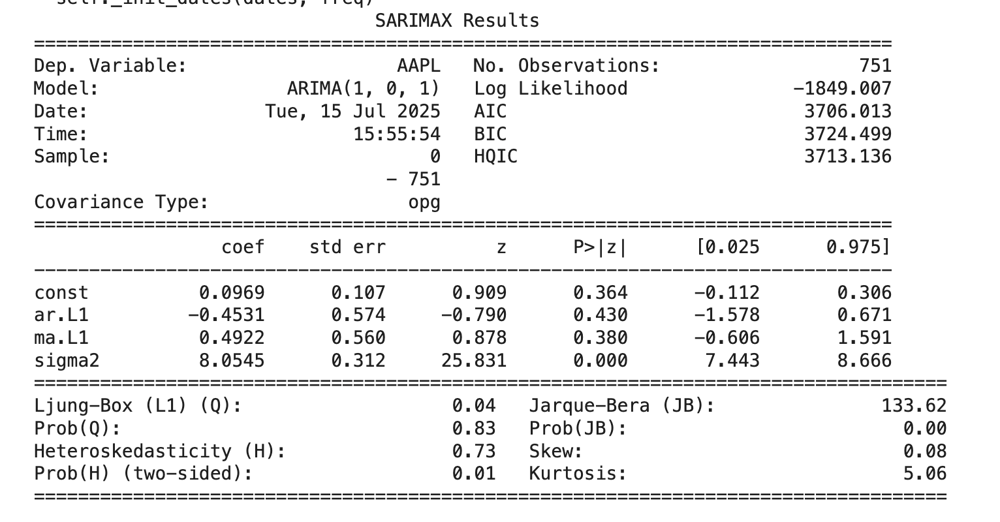

📌 **Step 4: Forecast Next 30 Days of Price Changes**
```
forecast_diff = fitted.forecast(steps=30)
forecast_diff.plot(title="Forecasted Daily Price Change (diff)")
plt.axhline(y=0, color='red', linestyle='--')
plt.grid()
plt.show()
```

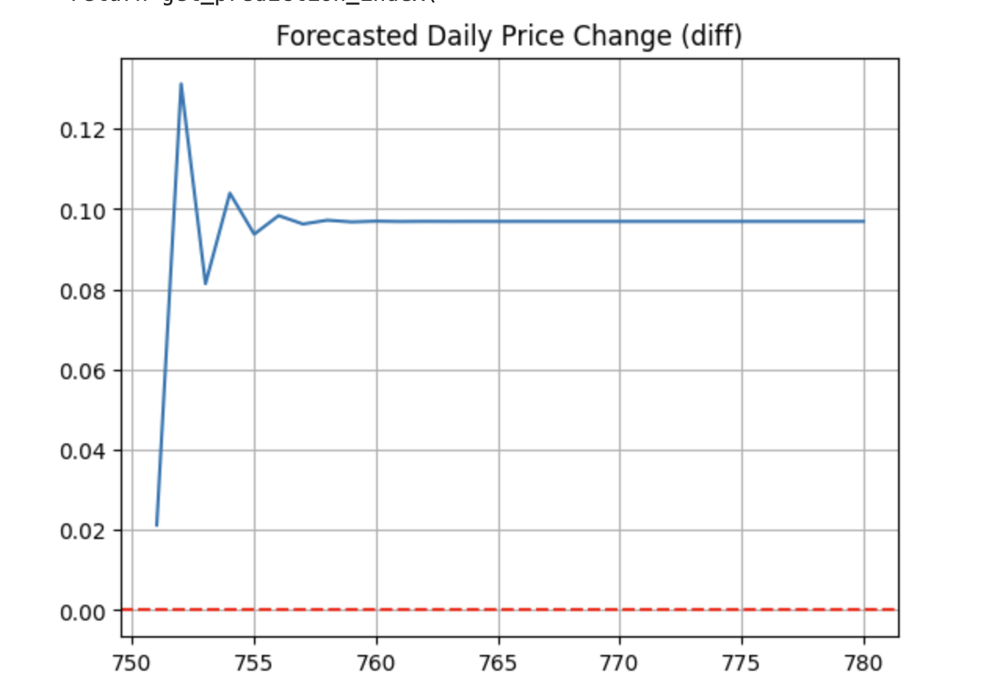

📌 **Step 5: Convert Diffs Back to Real Prices**
To get actual prices, add the diffs to the last known price:

```
# Step 1: Download data
df = yf.download("AAPL", start="2022-01-01", end="2024-12-31")
prices = df['Close'].dropna()

# ✅ Step 2: Fit ARIMA on original data (ARIMA will handle differencing)
model = ARIMA(prices, order=(1, 1, 1))  # d=1 for automatic differencing
fitted_model = model.fit()

# ✅ Step 3: Forecast future prices directly
forecast = fitted_model.forecast(steps=30)

# ✅ Step 4: Set future index
forecast_index = pd.bdate_range(start=prices.index[-1] + pd.Timedelta(days=1), periods=30)
forecast_series = pd.Series(forecast.values, index=forecast_index)

# ✅ Step 5: Plot actual + forecast
plt.figure(figsize=(14, 6))
plt.plot(prices[-60:], label='Actual Prices (last 60 days)', color='orange')
plt.plot(forecast_series, label='Forecasted Prices (next 30 days)', color='green', linestyle='--', marker='o')

plt.plot(
    [prices.index[-1], forecast_series.index[0]],
    [float(prices.iloc[-1]), float(forecast_series.iloc[0])],
    color='gray', linestyle=':', label='Actual → Forecast Transition'
)

plt.title("📈 AAPL Stock Price Forecast (ARIMA on original data)")
plt.xlabel("Date")
plt.ylabel("Price (USD)")
plt.grid(True)
plt.legend()
plt.tight_layout()
plt.show()
```

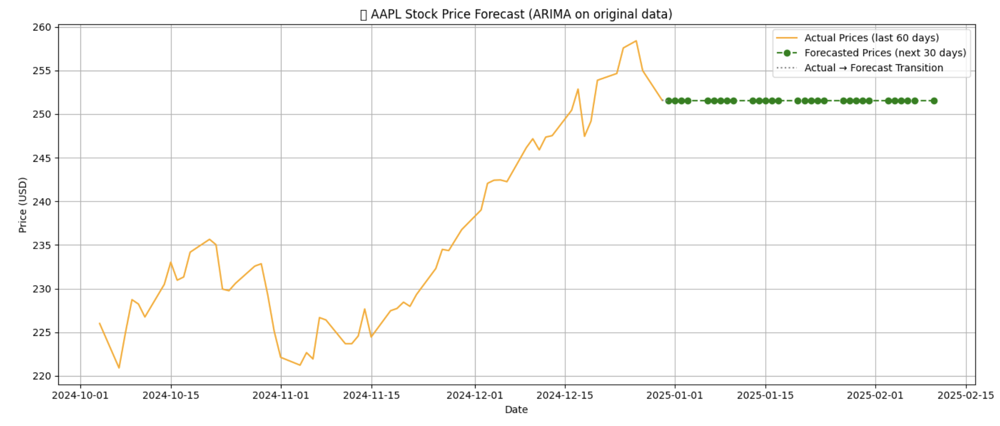

```
import yfinance as yf
import pandas as pd
import matplotlib.pyplot as plt
from statsmodels.tsa.arima.model import ARIMA

# Step 1: Load data
df = yf.download("AAPL", start="2022-01-01", end="2024-12-31")
prices = df['Close'].dropna()

# Step 2: Fit ARIMA model (let d=1 handle differencing)
model = ARIMA(prices, order=(1, 1, 1))
fitted_model = model.fit()

# Step 3: Forecast future values with confidence intervals
n_forecast = 30
forecast_result = fitted_model.get_forecast(steps=n_forecast)
forecast_mean = forecast_result.predicted_mean
conf_int = forecast_result.conf_int()

# Step 4: Create forecast index
forecast_index = pd.bdate_range(start=prices.index[-1] + pd.Timedelta(days=1), periods=n_forecast)
forecast_series = pd.Series(forecast_mean.values, index=forecast_index)
conf_df = pd.DataFrame(conf_int.values, index=forecast_index, columns=["Lower Bound", "Upper Bound"])

# Step 5: Plot actual, forecasted, and confidence interval
plt.figure(figsize=(14, 6))

# Actual
plt.plot(prices[-60:], label='Actual Prices', color='orange')

# Forecast
plt.plot(forecast_series, label='Forecasted Prices', color='green', linestyle='--', marker='o')

# Confidence intervals
plt.fill_between(
    forecast_index,
    conf_df["Lower Bound"],
    conf_df["Upper Bound"],
    color='green',
    alpha=0.2,
    label='95% Confidence Interval'
)

# Transition line
plt.plot(
    [prices.index[-1], forecast_index[0]],
    [float(prices.iloc[-1]), float(forecast_series.iloc[0])],
    color='gray', linestyle=':', label='Actual → Forecast Transition'
)

plt.title("📈 AAPL Stock Price Forecast (statsmodels ARIMA)")
plt.xlabel("Date")
plt.ylabel("Price (USD)")
plt.grid(True)
plt.legend()
plt.tight_layout()
plt.show()
```

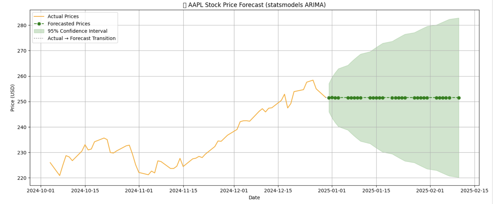


## pmdarima

✅ **Automatically selects best ARIMA parameters using pmdarima.auto_arima**
✅ **Forecasts future values with confidence intervals**
✅ **Plots actual, forecasted values, and 95% confidence bounds**
✅ **Works on stock prices or your sales data (CSV)**

✅ **1. 🔧 Install pmdarima (if not already installed)**
```
pip install pmdarima==1.8.5 numpy==1.23.5 --force-reinstall --no-cache-dir
```

✅ **2. Complete Code with Auto ARIMA + Confidence Intervals**

```
import yfinance as yf
import pandas as pd
import matplotlib.pyplot as plt
import pmdarima as pm

# Step 1: Download AAPL stock prices
df = yf.download("AAPL", start="2022-01-01", end="2024-12-31")
prices = df['Close'].dropna()

# Step 2: Auto ARIMA model selection
model = pm.auto_arima(
    prices,
    seasonal=False,
    stepwise=True,
    suppress_warnings=True,
    error_action="ignore",
    trace=True
)

# Step 3: Forecast next 30 business days with confidence intervals
n_forecast = 30
forecast, conf_int = model.predict(n_periods=n_forecast, return_conf_int=True)

# Step 4: Create future date index
forecast_index = pd.bdate_range(start=prices.index[-1] + pd.Timedelta(days=1), periods=n_forecast)

forecast_series = pd.Series(forecast, index=forecast_index)
conf_df = pd.DataFrame(conf_int, index=forecast_index, columns=["Lower Bound", "Upper Bound"])

# Step 5: Plot actual, forecast, and confidence intervals
plt.figure(figsize=(14, 6))

# Plot actual prices
plt.plot(prices[-60:], label="Actual Prices (last 60 days)", color="orange")

# Plot forecast
plt.plot(forecast_series, label="Forecasted Prices", color="green", linestyle="--", marker='o')

# Plot confidence interval (shaded area)
plt.fill_between(
    forecast_index,
    conf_df["Lower Bound"],
    conf_df["Upper Bound"],
    color="green",
    alpha=0.2,
    label="95% Confidence Interval"
)

# Draw connector line
plt.plot(
    [prices.index[-1], forecast_series.index[0]],
    [float(prices.iloc[-1]), float(forecast_series.iloc[0])],
    color='gray', linestyle=':', label='Actual → Forecast Transition'
)

plt.title("📈 AAPL Stock Price Forecast (Auto ARIMA with Confidence Interval)")
plt.xlabel("Date")
plt.ylabel("Price (USD)")
plt.grid(True)
plt.legend()
plt.tight_layout()
plt.show()
```


## Use Facebook Prophet or LSTM model instead

| Method                   | Pros                                                     | Cons                                         |
| ------------------------ | -------------------------------------------------------- | -------------------------------------------- |
| **Facebook Prophet**     | Easy to use, handles trends & seasonality, interpretable | Assumes additive/multiplicative components   |
| **LSTM** (Deep Learning) | Learns complex patterns, flexible                        | Needs more data & tuning, less interpretable |


1. **✅ Facebook Prophet Code (quick, interpretable)**

2. **✅ LSTM Code (deep learning with Keras)**

✅ **OPTION 1: Facebook Prophet**

🔧 **Install:**

```
pip install prophet
```

✅ **Code to Forecast AAPL with Prophet**

```
import yfinance as yf
import pandas as pd
import matplotlib.pyplot as plt
from prophet import Prophet

# Step 1: Download data
df = yf.download("AAPL", start="2022-01-01", end="2024-12-31")

# Step 2: Prepare data for Prophet
df = df.reset_index()
df = df[['Date', 'Close']]
df.columns = ['ds', 'y']  # Prophet needs ds (datetime) and y (value)

# Check for NaNs or data issues
df = df.dropna()
df['ds'] = pd.to_datetime(df['ds'])

# Step 3: Fit the model
model = Prophet(daily_seasonality=True)
model.fit(df)

# Step 4: Create future dates
future = model.make_future_dataframe(periods=30)
forecast = model.predict(future)

# Step 5: Plot forecast
fig1 = model.plot(forecast)
plt.title("📈 AAPL Forecast - Facebook Prophet")
plt.xlabel("Date")
plt.ylabel("Price")
plt.grid(True)
plt.show()
```
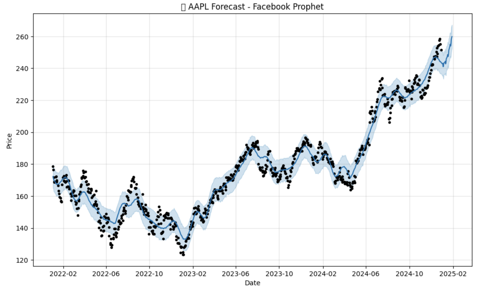


```
import yfinance as yf
import pandas as pd
import matplotlib.pyplot as plt
from prophet import Prophet

# Step 1: Load AAPL stock data
df = yf.download("AAPL", start="2022-01-01", end="2024-12-31")
df = df.reset_index()
df = df[['Date', 'Close']]
df.columns = ['ds', 'y']
df.dropna(inplace=True)
df['ds'] = pd.to_datetime(df['ds'])

# Step 2: Fit Prophet model
model = Prophet(daily_seasonality=True)
model.fit(df)

# Step 3: Forecast next 30 days
future = model.make_future_dataframe(periods=30)
forecast = model.predict(future)

# Step 4: Merge forecast with actual for overlay
forecast_filtered = forecast[['ds', 'yhat', 'yhat_lower', 'yhat_upper']]
merged = pd.merge(df, forecast_filtered, on='ds', how='outer')

# Step 5: Plot actual and forecast overlay
plt.figure(figsize=(14, 6))

# Plot actual values
plt.plot(merged['ds'], merged['y'], label='Actual', color='orange')

# Plot forecast values
plt.plot(merged['ds'], merged['yhat'], label='Forecast', color='green', linestyle='--')

# Confidence interval shading
plt.fill_between(
    merged['ds'],
    merged['yhat_lower'],
    merged['yhat_upper'],
    color='green',
    alpha=0.2,
    label='95% Confidence Interval'
)

plt.title("📈 AAPL Stock Price: Actual vs Forecast (Prophet)")
plt.xlabel("Date")
plt.ylabel("Price (USD)")
plt.legend()
plt.grid(True)
plt.tight_layout()
plt.show()
```
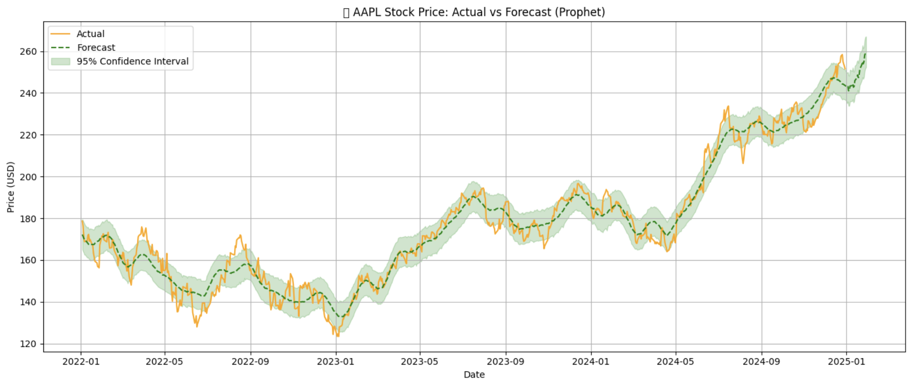


✅ **OPTION 2: LSTM Model with Keras (Deep Learning)**

🔧 **Install:**

```
pip install tensorflow
```

✅ **LSTM Code for Price Forecasting**

```
import yfinance as yf
import numpy as np
import pandas as pd
import matplotlib.pyplot as plt
from sklearn.preprocessing import MinMaxScaler
from tensorflow.keras.models import Sequential
from tensorflow.keras.layers import LSTM, Dense

# Load data
df = yf.download("AAPL", start="2022-01-01", end="2024-12-31")
data = df['Close'].values.reshape(-1, 1)

# Scale data
scaler = MinMaxScaler()
scaled_data = scaler.fit_transform(data)

# Create sequences
X, y = [], []
seq_len = 60  # Use past 60 days to predict next

for i in range(seq_len, len(scaled_data)):
    X.append(scaled_data[i-seq_len:i])
    y.append(scaled_data[i])

X, y = np.array(X), np.array(y)

# Build model
model = Sequential([
    LSTM(50, return_sequences=False, input_shape=(X.shape[1], 1)),
    Dense(1)
])
model.compile(optimizer='adam', loss='mse')
model.fit(X, y, epochs=10, batch_size=32, verbose=1)

# Forecast next 30 days
last_seq = scaled_data[-seq_len:]
forecast = []

for _ in range(30):
    input_seq = last_seq.reshape(1, seq_len, 1)
    pred = model.predict(input_seq, verbose=0)
    forecast.append(pred[0][0])
    last_seq = np.append(last_seq[1:], pred, axis=0)

# Inverse transform forecast
forecast_prices = scaler.inverse_transform(np.array(forecast).reshape(-1, 1))

# Create index
forecast_index = pd.bdate_range(start=df.index[-1] + pd.Timedelta(days=1), periods=30)

# Plot
plt.figure(figsize=(14, 6))
plt.plot(df.index[-60:], data[-60:], label='Actual Prices', color='orange')
plt.plot(forecast_index, forecast_prices, label='LSTM Forecast', color='green', linestyle='--', marker='o')
plt.title("📈 AAPL Stock Price Forecast (LSTM)")
plt.xlabel("Date")
plt.ylabel("Price (USD)")
plt.legend()
plt.grid(True)
plt.tight_layout()
plt.show()
```

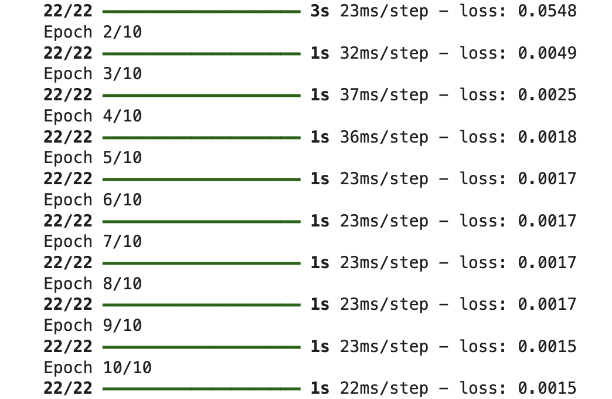

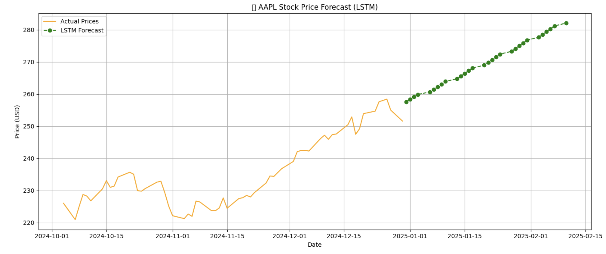


## Autocorrelation & Cross-Correlation

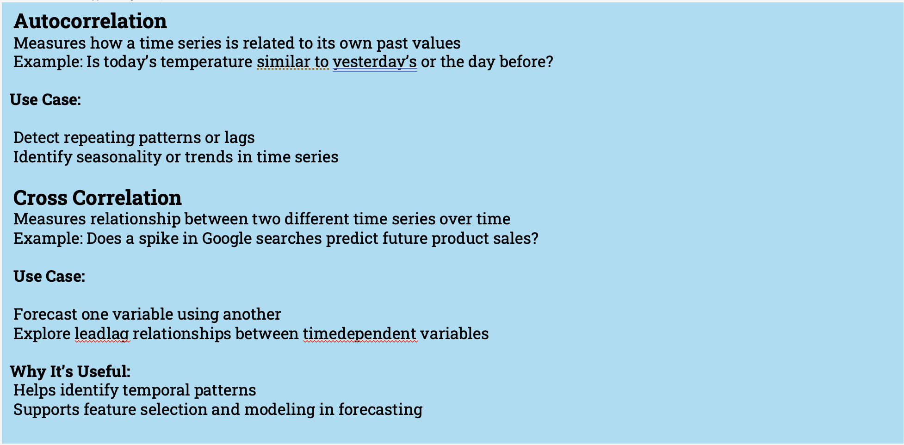

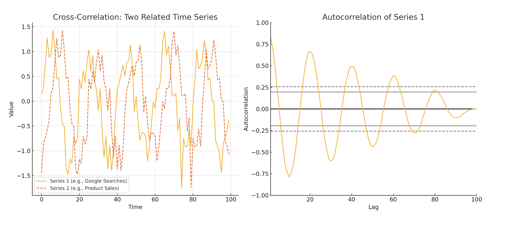


## Moving Averages & Smoothing

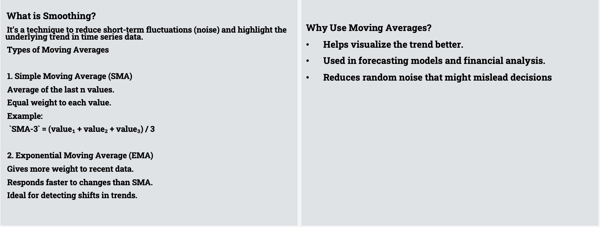


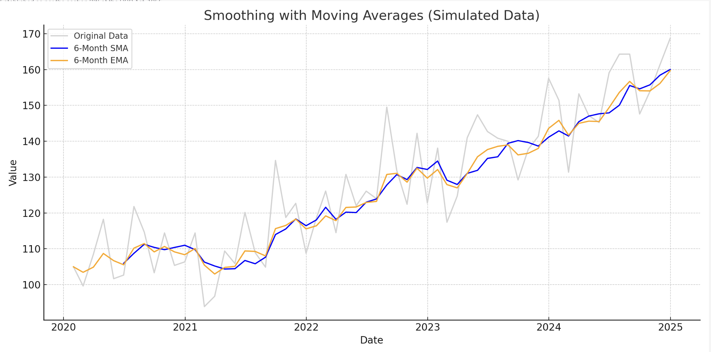


## Holt-Winters Method

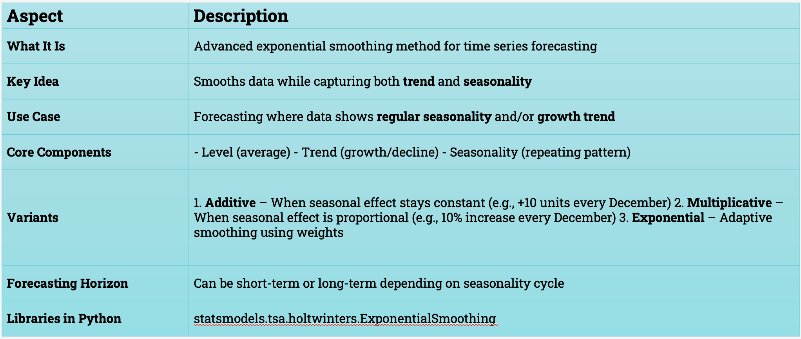

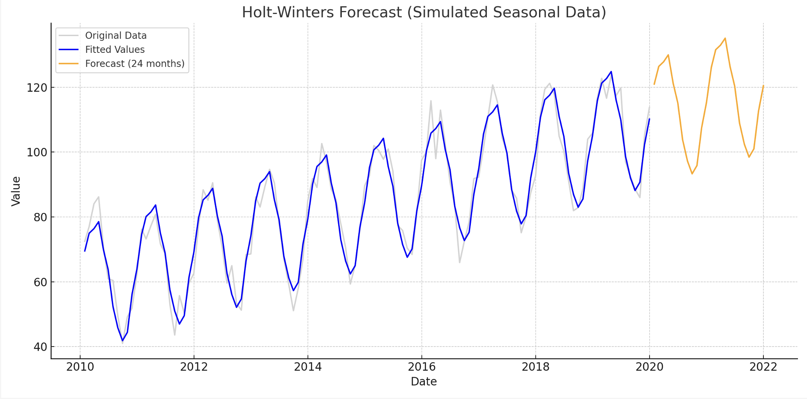


## Additive Vs Multiplicative Models

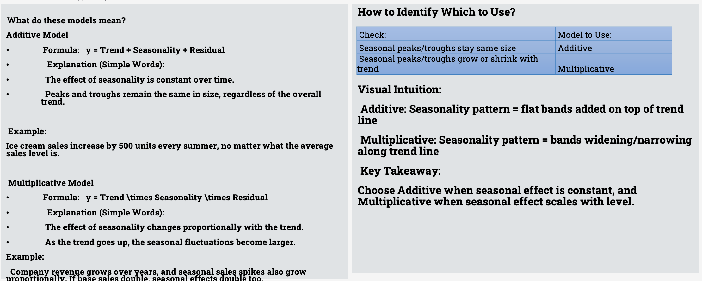

## AR (Auto Regression)

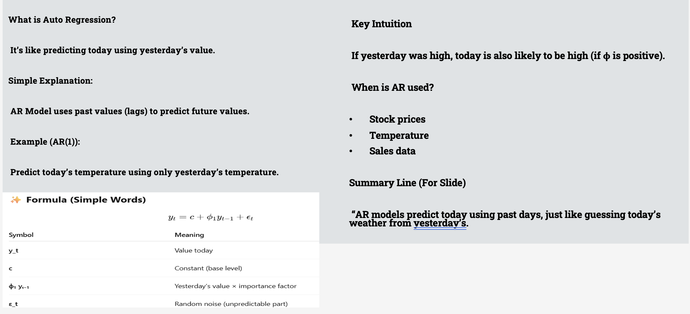

## ARIMA Models

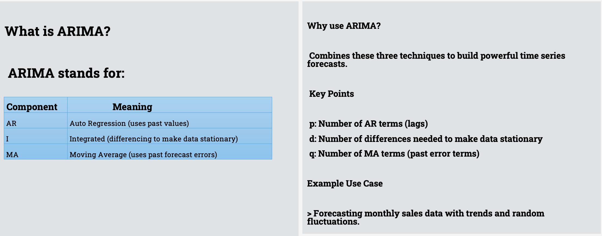


## Arimax Vs Sarimax

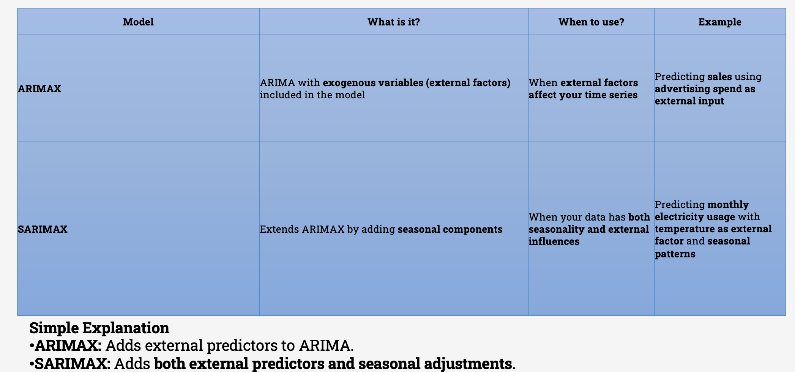


## Smoothing & Automated Forecasting

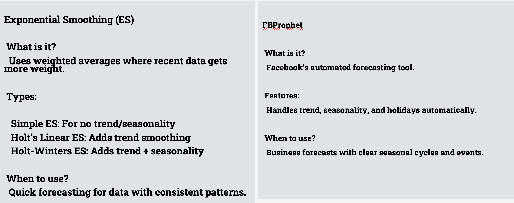


## Automated Time Series Models

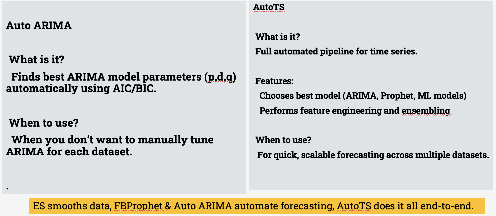


## Uni, Bi and Multivariate

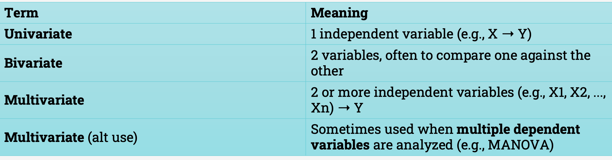


## Multivariate Analysis with code example

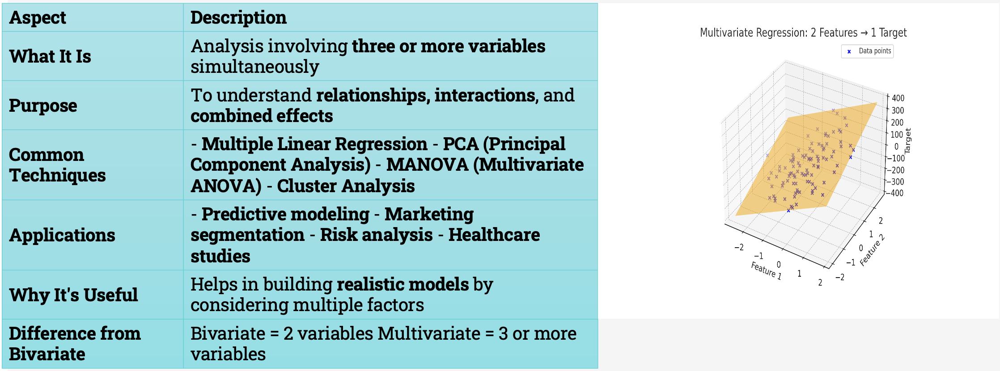


## Linear Regression

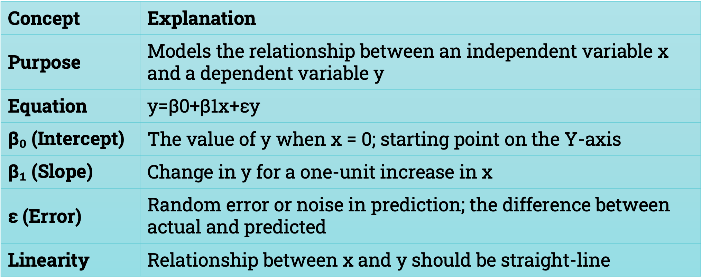


## Linear Regression Assumptions

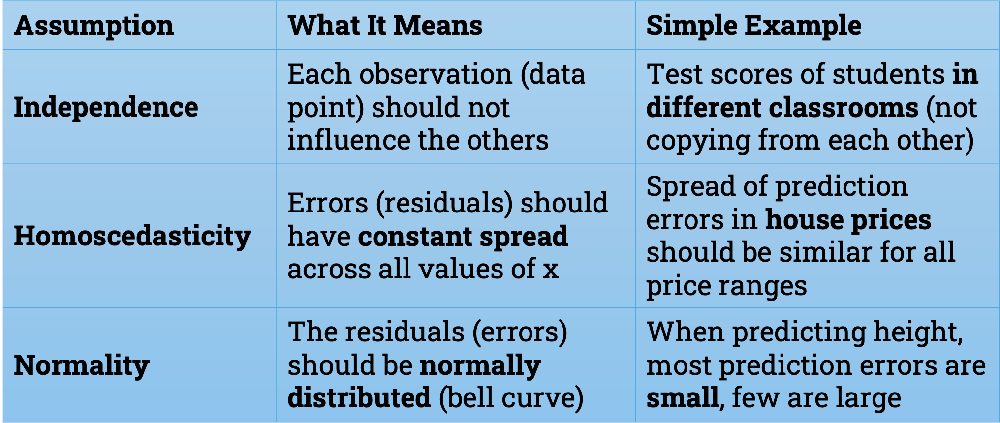

## End-to-End Regression Pipeline

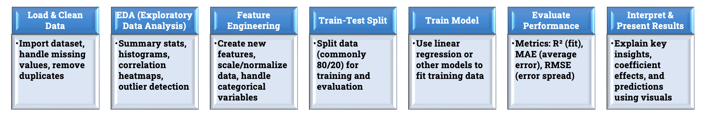

## Exploratory Data Analysis (EDA)

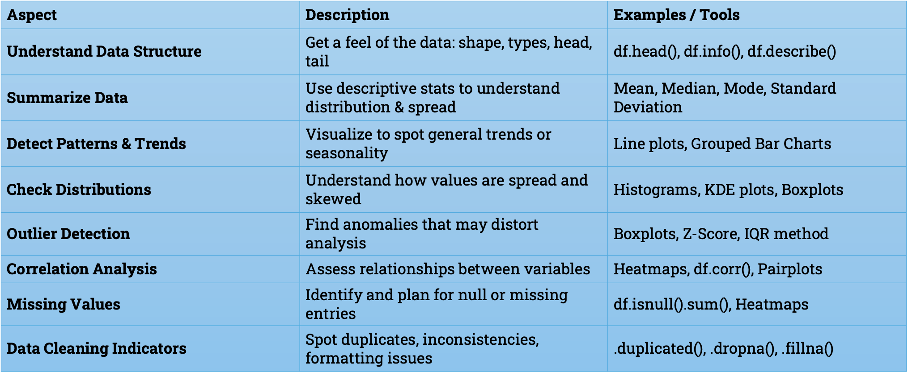

## Feature Engineering

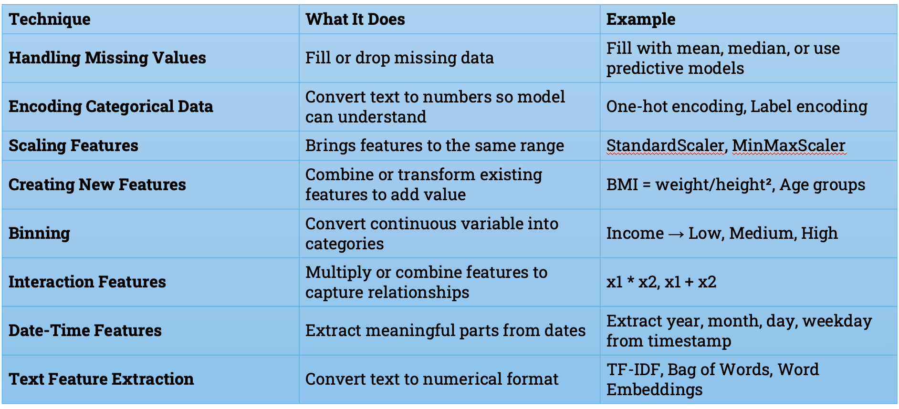

## Train-Test Split & Evaluation

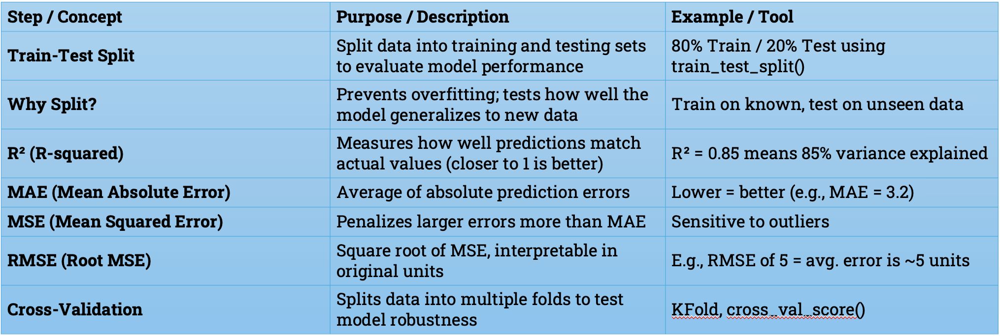


## Data Storytelling & Presentation

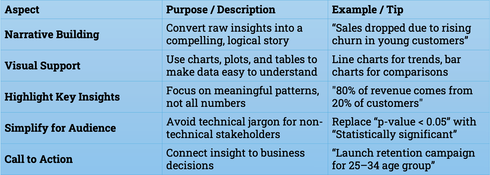

