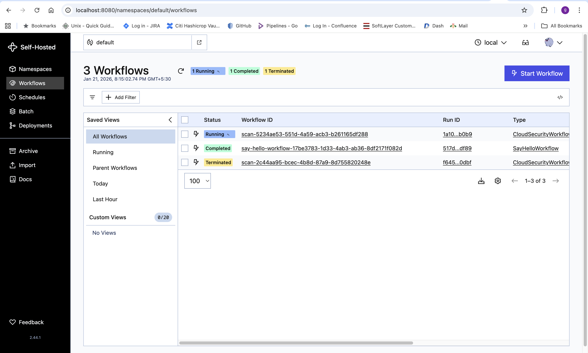
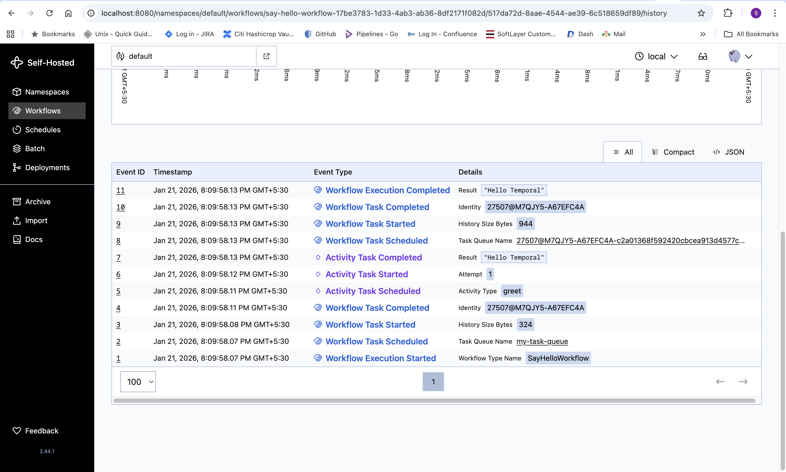

# Temporal setup


## Install Python

Make sure you have Python installed. Check your version of Python with the following command.

`python3 -V` -> `python 3.13.3`

## Install the Temporal Python SDK
You should install the Temporal Python SDK in your project using a virtual environment. Create a directory for your Temporal project, switch to the new directory, create a Python virtual environment, activate it, and then install the Temporal SDK.


`mkdir temporal-project`
`cd temporal-project`
`python3 -m venv env`
`source env/bin/activate`
`pip install temporalio`


## Install Temporal CLI

Configure a local Temporal Service for development.

The fastest way to get a development version of the Temporal Service running on your local machine is to use `Temporal CLI`.


**macOS:** 
Install the Temporal CLI using Homebrew:

`brew install temporal`

**Linux:** 
Download the Temporal CLI for your architecture:

https://temporal.download/cli/archive/latest?platform=linux&arch=amd64
https://temporal.download/cli/archive/latest?platform=linux&arch=arm64


Extract the archive and move the temporal binary into your PATH, for example:


`sudo mv temporal /usr/local/bin`

## Start the development server

Once you've installed Temporal CLI and added it to your PATH, open a new Terminal window and run the following command.

This command starts a local Temporal Service. It starts the Web UI, creates the default Namespace, and uses an in-memory database.

The Temporal Service will be available on `localhost:7233`. The Temporal Web UI will be available at `http://localhost:8233`.

Leave the local Temporal Service running as you work through tutorials and other projects. You can stop the Temporal Service at any time by pressing CTRL+C.

Once you have everything installed, you're ready to build apps with Temporal on your local machine.


Change the Web UI port
The Temporal Web UI may be on a different port in some examples or tutorials. To change the port for the Web UI, use the **`--ui-port`** option when starting the server:

`temporal server start-dev --ui-port 8080`

The Temporal Web UI will now be available at http://localhost:8080.


# Run Hello World: Test Your Installation

Now let's verify your setup is working by creating and running a complete Temporal application with both a Workflow and Activity.

This test will confirm that:

- The Temporal Python SDK is properly installed

- Your local Temporal Service is running

- You can successfully create and execute Workflows and Activities

- The communication between components is functioning correctly


## 1. Create the Activity

- Create an Activity file (**`activities.py`**):

```
from temporalio import activity

@activity.defn
async def greet(name: str) -> str:
    return f"Hello {name}"
```

An Activity is a normal function or method that executes a single, well-defined action (either short or long running), which often involve interacting with the outside world, such as sending emails, making network requests, writing to a database, or calling an API, which are prone to failure. If an Activity fails, Temporal automatically retries it based on your configuration.


## 2. Create the Workflow

Create a Workflow file (**`workflows.py`**):

Workflows orchestrate Activities and contain the application logic. Temporal Workflows are resilient. They can run and keep running for years, even if the underlying infrastructure fails. If the application itself crashes, Temporal will automatically recreate its pre-failure state so it can continue right where it left off.


## 3. Create the Worker

Create a Worker file (**`worker.py`**):

```
import asyncio
from temporalio.client import Client
from temporalio.worker import Worker
from workflows import SayHelloWorkflow
from activities import greet

async def main():
    client = await Client.connect("localhost:7233")
    worker = Worker(
        client,
        task_queue="my-task-queue",
        workflows=[SayHelloWorkflow],
        activities=[greet],
    )
    print("Worker started.")
    await worker.run()

if __name__ == "__main__":
    asyncio.run(main())
```

Run the Worker by opening up a new terminal:

Keep this terminal running - you should see "Worker started" displayed.


With your Activity and Workflow defined, you need a Worker to execute them. A Worker polls a Task Queue, that you configure it to poll, looking for work to do. Once the Worker dequeues the Workflow or Activity task from the Task Queue, it then executes that task.


Workers are a crucial part of your Temporal application as they're what actually execute the tasks defined in your Workflows and Activities. 

## 4. Execute the Workflow

Now that your Worker is running, it's time to start a Workflow Execution.

This final step will validate that everything is working correctly with your file labeled `starter.py`.

Create a separate file called `starter.py`:

```
import asyncio
import uuid
from temporalio.client import Client

async def main():
    client = await Client.connect("localhost:7233")
    result = await client.execute_workflow(
        "SayHelloWorkflow",
        "Temporal",
        id=f"say-hello-workflow-{uuid.uuid4()}",
        task_queue="my-task-queue",
    )
    print("Workflow result:", result)

if __name__ == "__main__":
    asyncio.run(main())
```

While the Worker is still running, run the following command in a new terminal:


Verify Success

If everything is working correctly, you should see:

- Worker processing the Workflow and Activity

- Output: `Workflow result: Hello Temporal`

- Workflow Execution details in the `Temporal Web UI`




